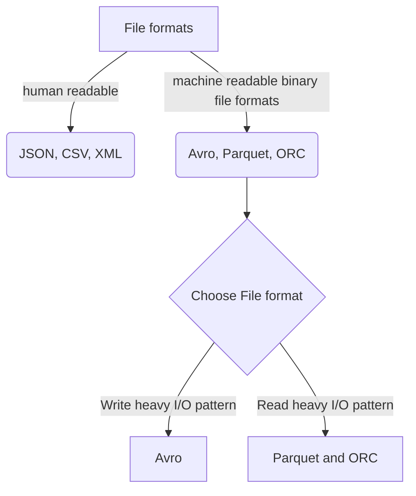

Azure data lake storage (adls) gen2 supports various file formats. Follow this recommendation from Microsoft while choosing the correct file format for your data operations.

**Note**

* Machine-readable binary file formats are compressed and have a schema embedded in each file.
* Avro stores data in a row-based format
  * Suited for write heavy I/O patterns
  * Ex: Avro format works well with a message bus such as Event Hub or Kafka that write multiple events/messages in succession.
* Parquet and ORC stores data in a columnar format.
  * Suited for read heavy I/O patterns.
  * Read transactions can be optimized to retrieve specific columns instead of entire record.
